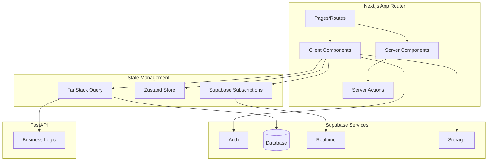

# ConnectHub Frontend Architecture

> **Stack**: Next.js 16 | React 19 | TailwindCSS 4 | Supabase SDK | Framer Motion

> [!NOTE]
> This architecture follows [Vercel React Best Practices](file:///c:/Users/PC/Documents/connecthub/connecthub_fe/.agent/skills/vercel-react-best-practices/SKILL.md) — 57 performance rules across 8 categories.

---

## Architecture Overview



---

## Vercel React Best Practices (Priority Order)

### 1. Eliminating Waterfalls (CRITICAL)

```typescript
// ❌ WRONG: Sequential fetches (3 round trips)
const user = await fetchUser()
const profile = await fetchProfile(user.id)
const photos = await fetchPhotos(user.id)

// ✅ CORRECT: Parallel with Promise.all (1 round trip)
const [user, profile, photos] = await Promise.all([
  fetchUser(),
  fetchProfile(userId),
  fetchPhotos(userId)
])
```

**Apply to:** Discovery page loading, profile data fetching, chat initialization.

### 2. Bundle Size Optimization (CRITICAL)

```typescript
// ❌ WRONG: Heavy component in main bundle
import { SwipeCard } from './SwipeCard'

// ✅ CORRECT: Dynamic import with next/dynamic
import dynamic from 'next/dynamic'

const SwipeCard = dynamic(
  () => import('./SwipeCard').then(m => m.SwipeCard),
  { 
    loading: () => <CardSkeleton />,
    ssr: false  // Client-only for gesture handling
  }
)
```

**Dynamically import:**
- `SwipeStack` (Framer Motion gestures ~50KB)
- `ChatRoom` (Real-time subscriptions)
- `PhotoUpload` (File handling)
- Analytics/logging (load after hydration)

### 3. Server-Side Performance (HIGH)

```typescript
// src/lib/queries/getProfile.ts
import { cache } from 'react'
import { createClient } from '@/lib/supabase/server'

// ✅ React.cache() for per-request deduplication
export const getProfile = cache(async (userId: string) => {
  const supabase = await createClient()
  const { data } = await supabase
    .from('profiles')
    .select('*')
    .eq('id', userId)
    .single()
  return data
})

// Multiple components can call getProfile(userId) - only 1 DB query
```

### 4. Client-Side Patterns (MEDIUM-HIGH)

```typescript
// ✅ Use passive listeners for scroll (prevents jank)
useEffect(() => {
  const handleScroll = () => { /* ... */ }
  window.addEventListener('scroll', handleScroll, { passive: true })
  return () => window.removeEventListener('scroll', handleScroll)
}, [])

// ✅ localStorage schema versioning
const STORAGE_VERSION = 1
const getStoredPrefs = () => {
  const data = localStorage.getItem('prefs')
  if (!data) return null
  const parsed = JSON.parse(data)
  if (parsed.version !== STORAGE_VERSION) return null
  return parsed.data
}
```

### 5. Re-render Optimization (MEDIUM)

```typescript
// ❌ WRONG: Object prop causes re-renders
<SwipeCard style={{ zIndex: 3 - i }} />

// ✅ CORRECT: Hoist default/static values
const cardStyles = { zIndex: 3 }
<SwipeCard style={cardStyles} />

// ✅ Use derived boolean state, not raw objects
const hasNewMessages = messages.length > lastReadCount  // Primitive!
```

```typescript
// ✅ Functional setState for stable callbacks
const handleSwipe = useCallback((direction: string) => {
  setCurrentIndex(prev => prev + 1)  // No dependency on currentIndex
}, [])

// ✅ Lazy state initialization for expensive values
const [candidates, setCandidates] = useState(() => 
  computeInitialCandidates()  // Only runs once
)
```

### 6. Rendering Performance (MEDIUM)

```typescript
// ✅ Use ternary for conditionals (not &&)
{isLoading ? <Skeleton /> : <Content />}

// ✅ content-visibility for long lists
<div className="content-visibility-auto contain-intrinsic-size-500px">
  {messages.map(msg => <MessageBubble key={msg.id} ... />)}
</div>

// ✅ useTransition for non-urgent updates
const [isPending, startTransition] = useTransition()
const handleFilter = (value: string) => {
  startTransition(() => setFilter(value))
}
```

### 7. JavaScript Performance (LOW-MEDIUM)

```typescript
// ✅ Use Set/Map for O(1) lookups
const likedUserIds = new Set(swipes.map(s => s.liked_id))
const hasLiked = likedUserIds.has(userId)  // O(1) vs O(n)

// ✅ Cache function results
const scoreCache = new Map<string, number>()
const getCompatibilityScore = (userId: string) => {
  if (scoreCache.has(userId)) return scoreCache.get(userId)!
  const score = computeScore(userId)
  scoreCache.set(userId, score)
  return score
}
```

### 8. Import Best Practices

```typescript
// ❌ WRONG: Barrel imports (tree-shaking issues)
import { Button, Card, Avatar } from '@/components/ui'

// ✅ CORRECT: Direct imports
import { Button } from '@/components/ui/Button'
import { Card } from '@/components/ui/Card'
import { Avatar } from '@/components/ui/Avatar'
```

## Route Structure

```
src/app/
├── (auth)/                      # Auth route group
│   ├── login/
│   │   └── page.tsx            # Email/OAuth login
│   ├── register/
│   │   └── page.tsx            # Sign up flow
│   ├── callback/
│   │   └── route.ts            # OAuth callback handler
│   ├── verify/
│   │   └── page.tsx            # Email verification
│   └── layout.tsx              # Auth layout (centered)
│
├── (onboarding)/               # First-time user setup
│   ├── profile/
│   │   └── page.tsx            # Basic info
│   ├── photos/
│   │   └── page.tsx            # Upload photos
│   ├── prompts/
│   │   └── page.tsx            # Dating prompts
│   ├── preferences/
│   │   └── page.tsx            # Match preferences
│   └── layout.tsx              # Wizard layout
│
├── (dashboard)/                # Main app
│   ├── discover/
│   │   └── page.tsx            # Swipe cards
│   ├── likes/
│   │   └── page.tsx            # People who liked you
│   ├── matches/
│   │   └── page.tsx            # Match list
│   ├── chat/
│   │   └── [matchId]/
│   │       └── page.tsx        # Chat room
│   ├── profile/
│   │   ├── page.tsx            # View own profile
│   │   └── edit/
│   │       └── page.tsx        # Edit profile
│   ├── settings/
│   │   └── page.tsx            # App settings
│   └── layout.tsx              # Dashboard layout + navbar
│
├── (public)/                   # Marketing pages
│   ├── page.tsx                # Landing/Hero
│   ├── about/
│   ├── blog/
│   └── help/
│
├── globals.css
├── layout.tsx                  # Root layout
└── not-found.tsx
```

---

## Component Architecture

### Directory Structure
```
src/components/
├── features/                   # Feature-specific components
│   ├── auth/
│   │   ├── LoginForm.tsx
│   │   ├── RegisterForm.tsx
│   │   ├── OAuthButtons.tsx
│   │   └── AuthGuard.tsx
│   │
│   ├── discovery/
│   │   ├── SwipeCard.tsx       # Individual profile card
│   │   ├── SwipeStack.tsx      # Card stack with gestures
│   │   ├── ActionButtons.tsx   # Like/Pass/Super Like
│   │   ├── ProfileDetail.tsx   # Expanded profile view
│   │   └── MatchModal.tsx      # "It's a Match!" overlay
│   │
│   ├── chat/
│   │   ├── ConversationList.tsx
│   │   ├── ConversationItem.tsx
│   │   ├── ChatRoom.tsx
│   │   ├── MessageBubble.tsx
│   │   ├── MessageInput.tsx
│   │   ├── TypingIndicator.tsx
│   │   └── OnlineStatus.tsx
│   │
│   ├── profile/
│   │   ├── ProfileForm.tsx
│   │   ├── PhotoGrid.tsx
│   │   ├── PhotoUpload.tsx
│   │   ├── PromptCard.tsx
│   │   ├── PromptEditor.tsx
│   │   └── PreferencesForm.tsx
│   │
│   └── settings/
│       ├── AccountSettings.tsx
│       ├── NotificationSettings.tsx
│       └── PrivacySettings.tsx
│
├── layout/
│   ├── Navbar.tsx
│   ├── Sidebar.tsx
│   ├── MobileNav.tsx
│   └── PageContainer.tsx
│
├── ui/                         # Reusable UI primitives
│   ├── Button.tsx
│   ├── Input.tsx
│   ├── Card.tsx
│   ├── Modal.tsx
│   ├── Avatar.tsx
│   ├── Badge.tsx
│   ├── Skeleton.tsx
│   └── Toast.tsx
│
└── shared/                     # Shared utilities
    ├── ErrorBoundary.tsx
    ├── LoadingSpinner.tsx
    └── EmptyState.tsx
```

---

## State Management Strategy

### 1. Server State (TanStack Query + Supabase)

```typescript
// src/hooks/useProfile.ts
import { useQuery, useMutation } from '@tanstack/react-query'
import { createClient } from '@/lib/supabase/client'

export function useProfile() {
  const supabase = createClient()
  
  return useQuery({
    queryKey: ['profile'],
    queryFn: async () => {
      const { data, error } = await supabase
        .from('profiles')
        .select('*')
        .single()
      if (error) throw error
      return data
    }
  })
}

export function useUpdateProfile() {
  const supabase = createClient()
  const queryClient = useQueryClient()
  
  return useMutation({
    mutationFn: async (updates: ProfileUpdate) => {
      const { data, error } = await supabase
        .from('profiles')
        .update(updates)
        .eq('id', userId)
        .select()
        .single()
      if (error) throw error
      return data
    },
    onSuccess: () => {
      queryClient.invalidateQueries({ queryKey: ['profile'] })
    }
  })
}
```

### 2. Auth State (Supabase Auth)

```typescript
// src/hooks/useAuth.ts
import { useEffect, useState } from 'react'
import { createClient } from '@/lib/supabase/client'
import type { User } from '@supabase/supabase-js'

export function useAuth() {
  const [user, setUser] = useState<User | null>(null)
  const [loading, setLoading] = useState(true)
  const supabase = createClient()

  useEffect(() => {
    // Get initial session
    supabase.auth.getUser().then(({ data: { user } }) => {
      setUser(user)
      setLoading(false)
    })

    // Listen for auth changes
    const { data: { subscription } } = supabase.auth.onAuthStateChange(
      (event, session) => {
        setUser(session?.user ?? null)
      }
    )

    return () => subscription.unsubscribe()
  }, [])

  return { user, loading }
}
```

### 3. Real-time State (Supabase Realtime)

```typescript
// src/hooks/useRealtimeMessages.ts
import { useEffect, useState } from 'react'
import { createClient } from '@/lib/supabase/client'

export function useRealtimeMessages(matchId: string) {
  const [messages, setMessages] = useState<Message[]>([])
  const supabase = createClient()

  useEffect(() => {
    // Fetch initial messages
    fetchMessages()

    // Subscribe to new messages
    const channel = supabase
      .channel(`match:${matchId}`)
      .on('postgres_changes', {
        event: 'INSERT',
        schema: 'public',
        table: 'messages',
        filter: `match_id=eq.${matchId}`
      }, (payload) => {
        setMessages(prev => [...prev, payload.new as Message])
      })
      .subscribe()

    return () => {
      supabase.removeChannel(channel)
    }
  }, [matchId])

  return { messages }
}
```

### 4. UI State (Zustand - optional, for complex UI)

```typescript
// src/stores/discoveryStore.ts
import { create } from 'zustand'

interface DiscoveryStore {
  currentIndex: number
  swipeDirection: 'left' | 'right' | null
  setCurrentIndex: (index: number) => void
  setSwipeDirection: (dir: 'left' | 'right' | null) => void
}

export const useDiscoveryStore = create<DiscoveryStore>((set) => ({
  currentIndex: 0,
  swipeDirection: null,
  setCurrentIndex: (index) => set({ currentIndex: index }),
  setSwipeDirection: (dir) => set({ swipeDirection: dir }),
}))
```

---

## Supabase Integration Patterns

### Client-Side Supabase

```typescript
// src/lib/supabase/client.ts
import { createBrowserClient } from '@supabase/ssr'
import type { Database } from '@/types/database'

export const createClient = () =>
  createBrowserClient<Database>(
    process.env.NEXT_PUBLIC_SUPABASE_URL!,
    process.env.NEXT_PUBLIC_SUPABASE_ANON_KEY!
  )
```

### Server-Side Supabase

```typescript
// src/lib/supabase/server.ts
import { createServerClient } from '@supabase/ssr'
import { cookies } from 'next/headers'
import type { Database } from '@/types/database'

export const createClient = async () => {
  const cookieStore = await cookies()
  
  return createServerClient<Database>(
    process.env.NEXT_PUBLIC_SUPABASE_URL!,
    process.env.NEXT_PUBLIC_SUPABASE_ANON_KEY!,
    {
      cookies: {
        getAll: () => cookieStore.getAll(),
        setAll: (cookiesToSet) => {
          cookiesToSet.forEach(({ name, value, options }) => {
            cookieStore.set(name, value, options)
          })
        },
      },
    }
  )
}
```

### Auth Middleware

```typescript
// src/middleware.ts
import { createServerClient } from '@supabase/ssr'
import { NextResponse, type NextRequest } from 'next/server'

export async function middleware(request: NextRequest) {
  let response = NextResponse.next({ request })
  
  const supabase = createServerClient(
    process.env.NEXT_PUBLIC_SUPABASE_URL!,
    process.env.NEXT_PUBLIC_SUPABASE_ANON_KEY!,
    {
      cookies: {
        getAll: () => request.cookies.getAll(),
        setAll: (cookies) => {
          cookies.forEach(({ name, value, options }) => {
            response.cookies.set(name, value, options)
          })
        },
      },
    }
  )

  const { data: { user } } = await supabase.auth.getUser()

  // Redirect unauthenticated users
  if (!user && request.nextUrl.pathname.startsWith('/(dashboard)')) {
    return NextResponse.redirect(new URL('/login', request.url))
  }

  return response
}

export const config = {
  matcher: ['/((?!_next/static|_next/image|favicon.ico).*)'],
}
```

---

## Design System

### Color Palette (TailwindCSS)

```typescript
// tailwind.config.ts
const config = {
  theme: {
    extend: {
      colors: {
        // Brand colors
        primary: {
          50: '#fdf2f8',
          500: '#ec4899',  // Pink accent
          600: '#db2777',
          700: '#be185d',
        },
        secondary: {
          500: '#8b5cf6',  // Purple
        },
        // Semantic colors
        success: '#10b981',
        warning: '#f59e0b',
        error: '#ef4444',
        // Dark mode surfaces
        surface: {
          dark: '#1a1a2e',
          card: '#16213e',
        }
      },
    },
  },
}
```

### Typography

```css
/* globals.css */
@import url('https://fonts.googleapis.com/css2?family=Inter:wght@400;500;600;700&display=swap');

:root {
  --font-sans: 'Inter', system-ui, sans-serif;
}
```

### Motion (Framer Motion)

```typescript
// src/lib/animations.ts
export const fadeIn = {
  initial: { opacity: 0 },
  animate: { opacity: 1 },
  exit: { opacity: 0 },
}

export const slideUp = {
  initial: { opacity: 0, y: 20 },
  animate: { opacity: 1, y: 0 },
  exit: { opacity: 0, y: -20 },
}

export const swipeCard = {
  exit: (direction: 'left' | 'right') => ({
    x: direction === 'left' ? -300 : 300,
    opacity: 0,
    rotate: direction === 'left' ? -15 : 15,
    transition: { duration: 0.3 }
  })
}
```

---

## Key Features Implementation

### 1. Swipe Stack (Discovery)

```typescript
// src/components/features/discovery/SwipeStack.tsx
'use client'

import { useState } from 'react'
import { motion, AnimatePresence } from 'framer-motion'
import { SwipeCard } from './SwipeCard'
import { useDiscoveryCandidates, useSwipe } from '@/hooks/useDiscovery'

export function SwipeStack() {
  const { data: candidates, isLoading } = useDiscoveryCandidates()
  const swipeMutation = useSwipe()
  const [currentIndex, setCurrentIndex] = useState(0)

  const handleSwipe = async (direction: 'LEFT' | 'RIGHT' | 'SUPER_LIKE') => {
    const candidate = candidates?.[currentIndex]
    if (!candidate) return
    
    await swipeMutation.mutateAsync({
      likedId: candidate.id,
      direction
    })
    
    setCurrentIndex(prev => prev + 1)
  }

  return (
    <div className="relative h-[600px] w-full max-w-sm mx-auto">
      <AnimatePresence>
        {candidates?.slice(currentIndex, currentIndex + 3).map((profile, i) => (
          <SwipeCard
            key={profile.id}
            profile={profile}
            style={{ zIndex: 3 - i }}
            onSwipe={i === 0 ? handleSwipe : undefined}
          />
        ))}
      </AnimatePresence>
    </div>
  )
}
```

### 2. Real-time Chat

```typescript
// src/components/features/chat/ChatRoom.tsx
'use client'

import { useRef, useEffect } from 'react'
import { useRealtimeMessages } from '@/hooks/useRealtimeMessages'
import { MessageBubble } from './MessageBubble'
import { MessageInput } from './MessageInput'

export function ChatRoom({ matchId }: { matchId: string }) {
  const { messages } = useRealtimeMessages(matchId)
  const scrollRef = useRef<HTMLDivElement>(null)

  // Auto-scroll on new messages
  useEffect(() => {
    scrollRef.current?.scrollIntoView({ behavior: 'smooth' })
  }, [messages.length])

  return (
    <div className="flex flex-col h-full">
      <div className="flex-1 overflow-y-auto p-4 space-y-2">
        {messages.map(msg => (
          <MessageBubble key={msg.id} message={msg} />
        ))}
        <div ref={scrollRef} />
      </div>
      <MessageInput matchId={matchId} />
    </div>
  )
}
```

### 3. Photo Upload (Supabase Storage)

```typescript
// src/components/features/profile/PhotoUpload.tsx
'use client'

import { useState } from 'react'
import { createClient } from '@/lib/supabase/client'
import { useQueryClient } from '@tanstack/react-query'

export function PhotoUpload({ userId }: { userId: string }) {
  const [uploading, setUploading] = useState(false)
  const supabase = createClient()
  const queryClient = useQueryClient()

  const handleUpload = async (e: React.ChangeEvent<HTMLInputElement>) => {
    const file = e.target.files?.[0]
    if (!file) return

    setUploading(true)
    
    const fileExt = file.name.split('.').pop()
    const filePath = `${userId}/${Date.now()}.${fileExt}`

    const { error: uploadError } = await supabase.storage
      .from('photos')
      .upload(filePath, file)

    if (!uploadError) {
      // Save to database
      await supabase.from('photos').insert({
        user_id: userId,
        storage_path: filePath,
        order_index: 0, // Set appropriately
      })
      
      queryClient.invalidateQueries({ queryKey: ['photos'] })
    }

    setUploading(false)
  }

  return (
    <label className="cursor-pointer">
      <input type="file" accept="image/*" onChange={handleUpload} hidden />
      <div className="border-2 border-dashed rounded-lg p-8 text-center">
        {uploading ? 'Uploading...' : 'Click to upload'}
      </div>
    </label>
  )
}
```

---

## Environment Variables

```bash
# .env.local
NEXT_PUBLIC_SUPABASE_URL=your-supabase-url
NEXT_PUBLIC_SUPABASE_ANON_KEY=your-anon-key
NEXT_PUBLIC_API_URL=http://localhost:8000  # FastAPI

# Server-only
SUPABASE_SERVICE_ROLE_KEY=your-service-role-key
```

---

## Dependencies to Add

```bash
npm install @supabase/supabase-js @supabase/ssr
npm install @tanstack/react-query
npm install zustand
npm install framer-motion  # Already installed
npm install react-hot-toast
npm install date-fns
```

---

## File Generation Priority

### Phase 1: Auth & Foundation
1. `src/lib/supabase/client.ts`
2. `src/lib/supabase/server.ts`
3. `src/middleware.ts`
4. `src/hooks/useAuth.ts`
5. `src/app/(auth)/login/page.tsx`
6. `src/components/features/auth/OAuthButtons.tsx`

### Phase 2: Profile & Onboarding
7. `src/hooks/useProfile.ts`
8. `src/app/(onboarding)/layout.tsx`
9. `src/components/features/profile/ProfileForm.tsx`
10. `src/components/features/profile/PhotoUpload.tsx`

### Phase 3: Discovery
11. `src/hooks/useDiscovery.ts`
12. `src/components/features/discovery/SwipeCard.tsx`
13. `src/components/features/discovery/SwipeStack.tsx`
14. `src/app/(dashboard)/discover/page.tsx`

### Phase 4: Chat
15. `src/hooks/useRealtimeMessages.ts`
16. `src/components/features/chat/ChatRoom.tsx`
17. `src/app/(dashboard)/chat/[matchId]/page.tsx`
